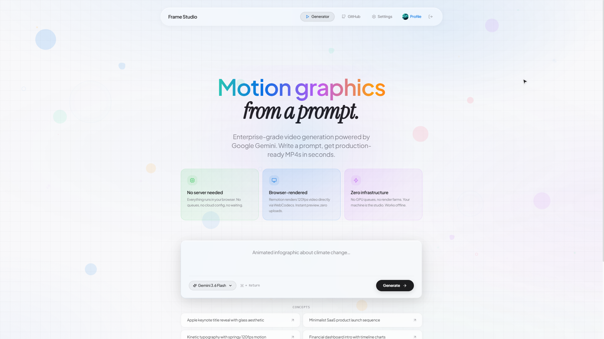

# Frame Studio



AI motion graphics generator using React, Remotion, TypeScript, and Google Gemini API.

Provide a text prompt. Frame Studio generates a Remotion video project, compiles it, renders an MP4 **directly in your browser**, and downloads it. No server-side rendering, no AWS, no credit card needed.

## Architecture

```
Browser                 Server (Vercel - FREE)
   │                          │
   │── prompt ──────────────► │
   │                          │── Plan (Gemini)
   │                          │── Codegen (Gemini)
   │                          │── TypeScript check + fix loop
   │                          │── Compile TSX → JS (esbuild)
   │◄── compiled code ─────── │
   │                          │
   │── renderMediaOnWeb()     │
   │── (WebCodecs + Mediabunny)
   │── download MP4           │
```

**Flow:**
1. Plan: Gemini creates video structure from prompt
2. Codegen: Gemini writes React/Remotion code
3. Compile: TypeScript validation in sandbox
4. Fix: Gemini repairs compilation errors (max 3 attempts)
5. Server compiles TSX → JS using esbuild
6. Browser evaluates the code and renders MP4 using `@remotion/web-renderer`
7. Instant download — no queue, no waiting

**Tech:**
- Next.js 15 (free Vercel deployment)
- Remotion 4.0 for video rendering (client-side via WebCodecs)
- Google Gemini API for AI code generation
- Supabase for auth, storage, and database
- PWA-ready with manifest + standalone display
- **Zero infrastructure costs** — no servers, no AWS, no credit card

## Prerequisites

- Node.js 18+
- pnpm
- Google Gemini API key
- Supabase project (free tier)

## Setup

### 1. Install dependencies

```bash
pnpm install
```

### 2. Configure environment

Copy `.env.example` to `.env.local` and fill in the values:

```bash
cp .env.example .env.local
```

```env
GEMINI_API_KEY=your_gemini_key
NEXT_PUBLIC_SUPABASE_URL=https://your-project.supabase.co
NEXT_PUBLIC_SUPABASE_ANON_KEY=your_anon_key
NEXT_PUBLIC_SITE_URL=http://localhost:3000
```

### 3. Set up Supabase

1. Create a project at [supabase.com](https://supabase.com)
2. Go to **Authentication → Providers** and enable **Email/Password**
3. Set **Site URL** to `http://localhost:3000` (or your production URL)
4. Run the SQL from [`supabase-setup.sql`](./supabase-setup.sql) in the SQL editor

### 4. Run

```bash
pnpm dev
```

Application runs at `http://localhost:3000`.

You can also provide your Gemini API key in the web UI instead of the env var.

## Deployment (Vercel — free)

```bash
pnpm build
```

Deploy to Vercel. Set these environment variables in Vercel:

| Variable | Description |
|---|---|
| `GEMINI_API_KEY` | Your Gemini API key |
| `NEXT_PUBLIC_SUPABASE_URL` | Supabase project URL |
| `NEXT_PUBLIC_SUPABASE_ANON_KEY` | Supabase anon/public key |
| `NEXT_PUBLIC_SITE_URL` | Your production URL (e.g. `https://frame-studio.vercel.app`) |

Also update the Supabase Dashboard **Site URL** and **Redirect URLs** to match your production domain.

## Features

### Core
- **Zero infrastructure** — renders entirely in the browser
- **Model selector** (8 Gemini models)
- **Real-time progress screen** with stage updates
- **Concept presets** — apply-style buttons for quick prompts
- **Duration presets** — Auto (AI), 5s, 10s, 15s, 30s, 1m, 2m, 3m, 5m, 10m, 15m
- **PDF content extraction** — upload PDFs and generate videos from their content
- **Sponsor banner** — permanent banner linking to GitHub Sponsors
- **Data visualization** — AI generates SVG charts, graphs, and data tables in videos
- **Improved system prompts** — better layout, chart rendering, and presentation quality

### Account (Supabase)
- **Sign up / sign in** - email/password or magic link
- **Forgot password** - reset flow with branded email
- **Profile settings** - edit name, change email, update password
- **Avatar upload** - profile picture stored in Supabase Storage
- **Video history** - save videos, browse on profile, preview & delete

### UI
- **Apple Liquid Glass design** - frosted glass materials, specular highlights, grain textures
- **Responsive layout** - bottom tab nav on mobile, floating pill header on desktop
- **PWA-ready** - manifest.json, standalone display, apple-touch-icon
- **Custom animated cursor** - macOS-style arrow (hidden on touch devices)
- **Smooth animations** - framer-motion micro-interactions throughout

### Email (branded)
- **CDN-loaded Plus Jakarta Sans** from Google Fonts
- **Gradient accent bars** matching each email's purpose
- **Premium CTA buttons** with subtle glow
- **Clean white cards** on light gray background

## Browser Support

Client-side video rendering requires the [WebCodecs API](https://caniuse.com/webcodecs):
- Chrome 94+
- Firefox 130+
- Edge 94+

## Development

```bash
pnpm dev        # Start dev server
pnpm build      # Production build
pnpm lint       # Lint
```

## Project Structure

```
apps/web/                 Next.js app with API routes and UI
├── app/
│   ├── api/
│   │   ├── apikey/       API key management (httpOnly cookie)
│   │   ├── auth/user/    Current user endpoint
│   │   ├── generate/     Video generation pipeline
│   │   └── videos/       Save / list / delete saved videos
│   ├── auth/
│   │   ├── callback/     OAuth + auth callback handler
│   │   ├── signin/       Sign-in page (password + magic link)
│   │   ├── signout/      Sign-out route
│   │   ├── signup/       Sign-up page
│   │   ├── forgot-password/  Request reset link
│   │   └── reset-password/   Set new password
│   ├── profile/          Video history grid with preview & delete
│   └── settings/         Edit name, email, password, avatar
├── components/
│   ├── Header.tsx        Desktop pill nav / mobile bottom tab bar
│   ├── PreviewScreen.tsx Full-screen mobile preview with save/download
│   ├── PromptBox.tsx     Prompt input with model/duration/PDF controls
│   ├── SponsorBanner.tsx Dismissible sponsor banner with glass material
│   └── ...               ProgressScreen, Footer, ApiKeyModal, etc.
├── lib/
│   ├── supabase/
│   │   ├── client.ts     Browser Supabase client
│   │   └── server.ts     Server Supabase client (cookies)
│   └── apiKey.ts         Server-side API key cookie management
├── public/
│   ├── manifest.json     PWA manifest
│   ├── icon.svg          App icon (256x256)
│   └── favicon.ico       Browser favicon
└── middleware.ts          Auth redirect middleware
packages/pipeline/          AI processing (prompts, schemas, LLM client)
packages/remotion-skeleton/ Template for video projects
```

## Notes

- Uses webpack (not Turbopack) for stability
- Gemini API key stored in HTTP-only cookies
- Saved videos stored in Supabase Storage (`videos` bucket)
- Video metadata stored in a `videos` PostgreSQL table (RLS-protected)
- Avatars stored in Supabase Storage (`avatars` bucket)
- Videos render at 1920x1080, 30fps
- Custom cursor is disabled on touch devices automatically
- Email templates load Plus Jakarta Sans from Google Fonts CDN

## License

MIT
